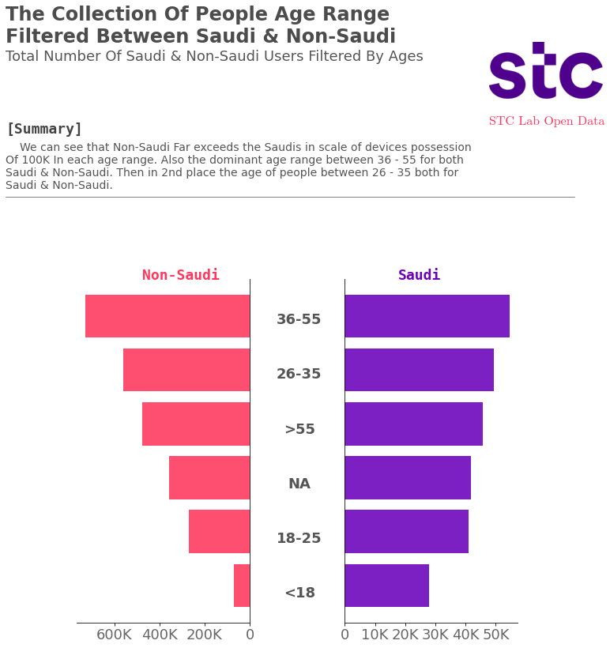

# Data Analysis & Statistical Hypothesis & Time Series Forecasting On STC Uncommon devices dataset


> This work points & Analysis is the author opinions and doesn't speak for anybody.


## Overview of STC Uncommon handheld devices
It's a dataset about various handheld devices that have been collected it's information in the span of 2 years and has features like brand names, vendor names, support of the device for 2G, 3G, 4G, etc.. Also the total number of how many users. Overall the dataset contains ~3 Millions record.


## Plan Of Attack

**Data Analysis  with pandas and manipulation if needed. The steps will be:**
  
- Fix structural errors
- Inspect features and values
  - Check for duplicates
  - Dive deep with each columns values
- Optimization of DataFrame
- Change DataFrame columns
- Data attributes information

**Statistical Analysis & Hypothesis Testing**

- Standard Deviation
- T-test
- Chi-square test

**Data Visualization (Explatory Data Analysis)**

- TOP-15 Brands Used by people
- Preference of devices type between Saudi & Non-Saudi
- The Age range of Saudi & Non-Saudi who uses those devices
- Total Device Number in possession between Saudi & Non-Saudi During the period of 2 years
- The preference in deivces in the support of 2G, 3G, 4G, WIFI, BLUETOOTH, TOUCHSCREEN, DUAL SIM.
  - The Comparison between 2G, 3G, 4G.
  - The Comparison between bluetooth, touchscreen, Dual SIM.
- OS Preference between Saudi & Non-Saudi
- Most Popular Device Holders Filtered By Nationalities

**Time Series Forecasting**

We'll Try to prepare the **N-Beats** replication from the famous paper N-Beats! https://arxiv.org/pdf/1905.10437.pdf

And try to forecast the demand on uncommon handheld devices


## Data Analysis

### Fix Structural Errors

Structural Errors in a dataset means the data either have typos or inconsistent spellings.

We'll inspect Every Column have a category type or similar to string nature.

```Python
# Remove unwanted whitespaces from vendor names
df["VENDOR_NAME"] = df["VENDOR_NAME"].map(lambda x: x.strip())
",".join(list(df["VENDOR_NAME"].value_counts().index))
```
Fixing Some Incosistent names with spaces, due to the dataset a little bit uncleaned on csv format.

So After removing the additonal spaces. Now we need to Inspect manually If there's some misspelled names which gives a duplicate effect.

After Inspecting Everything seems fine, except for standardization sake we need to change "Dinuotong Technology." to "Dinuotong Technology" without the full stop at the end because ALL the name of vendors in this dataset doesn't have a fullstop at the end of the names. Except something like "B.easy" which is a dot at the middle of the name and that's a fair point because It's part of the company name.

```py
# Remove the dot at the end of company name
df["VENDOR_NAME"] = df["VENDOR_NAME"].str.replace("Dinuotong Technology.", "Dinuotong Technology")
```

So After we knew there's a huge problem with duplicate values caused by whitespaces we'll build a pipeline for pandas to convert a bunch of columns, So by doing this we follow the protocol of DRY code.

The Function:

```py
# Setting the columns to be cleaned from whitespaces
spaces_col_list = ["MODEL_NAME", "BRAND_FULL_NAME", "BRAND_NAME", "OS_NAME", "DEVICE_TYPE", "NATIONALITY_CD", "NATIONALITY_NAME", "AGE_B", "SAUDI_NON_SAUDI"]
# Create the Function to call upon .pipe pandas
def clean_whitespace(dataframe, affected_cols=None):
    """
    Function To Remove The Unwanted or Additional Whitespace From Feature values

    Args:
    dataframe: the whole dataframe from pandas (Pandas DataFrame)
    affected_cols: the specific columns you want to clean the whitespaces from. (list)

    Return:
    The whole dataframe cleaned. (DataFrame Object)
    """
    for col in affected_cols:
        dataframe[col] = dataframe[col].str.strip()
    print("Done Cleaning!")
    return dataframe
```

By This we can leverage the power of pandas pipeline and clean all those whitespaces in one go!

```py
# Call .pipe to call the pipeline we created
df.pipe(clean_whitespace, affected_cols=spaces_col_list)
```

---

After inspection of some features value I came across some weird values:

the "BRAND_NAME" Column there's one brand I'm uncertain of which is: @phone. So I can't make the descion due to little information. For which brand could I classify it.

---
### Inspect Features and Values

Enough with fixing the Structural Errors. It's time to inspect more on our columns and which values stored in there. Which data types and get more in-depth description.

```py
# Get detailed information on the DataFrame
df.info()

<class 'pandas.core.frame.DataFrame'>
RangeIndex: 3150708 entries, 0 to 3150707
Data columns (total 20 columns):
 #   Column            Dtype         
---  ------            -----         
 0   CAL_DT            datetime64[ns]
 1   MODEL_NAME        object        
 2   BRAND_FULL_NAME   object        
 3   BRAND_NAME        object        
 4   VENDOR_NAME       object        
 5   OS_NAME           object        
 6   DEVICE_TYPE       object        
 7   _2G_FLG           object        
 8   _3G_FLG           object        
 9   _4G_FLG           object        
 10  WIFI_FLG          object        
 11  BLUETOOTH_FLG     object        
 12  TOUCH_SCREEN_FLG  object        
 13  DUAL_SIM_FLG      object        
 14  GENDER_TYPE_CD    object        
 15  AGE_B             object        
 16  NATIONALITY_CD    object        
 17  NATIONALITY_NAME  object        
 18  SAUDI_NON_SAUDI   object        
 19  DEVICE_COUNT      int64         
dtypes: datetime64[ns](1), int64(1), object(18)
memory usage: 480.8+ MB
```

From this we can get information like:

- ALL columns are object type except "DEVICE_COUNT" & "CAL_DT"
- Obviously, When we work with BIG datasets like this one, The Null values can't be interpreted by pandas as shown above.
- Huge Memory usage 480 MB for a SINGLE DataFrame.

Firstly, Before Manipulating or visualizing or optimizing anything we need to check the Nulls If ANY.

```py
# Check Null values or NaNs
df.isnull().sum()

CAL_DT                   0
MODEL_NAME               0
BRAND_FULL_NAME          0
BRAND_NAME               0
VENDOR_NAME              0
OS_NAME                  0
DEVICE_TYPE              0
_2G_FLG                  0
_3G_FLG                  0
_4G_FLG                  0
WIFI_FLG                 0
BLUETOOTH_FLG            0
TOUCH_SCREEN_FLG         0
DUAL_SIM_FLG             0
GENDER_TYPE_CD      377660
AGE_B                    0
NATIONALITY_CD      319610
NATIONALITY_NAME    319605
SAUDI_NON_SAUDI          0
DEVICE_COUNT             0
dtype: int64
```

We can clearly see here:

- GENDER_TYPE_CD Column which have 377660 Null value
- NATIONALITY_CD Column which have 319610 Null value
- NATIONALITY_NAME Column which have 319605 Null value
  
So We'll need to drop those nulls because It's already messed up the information in the dataset so it doesn't get chunky with misinformation in the data visualization part later.

---
#### Check For Duplicates

```py
# Create mask for duplicates & Visualize
mask_duplicates = df.duplicated()
df[mask_duplicates]
```
After checking for duplicates .. It's NONE we don't have any duplicates in the dataset.

---
### Dive deep with each columns values

Inspecting the Column **AGE_B**:

Good to know there's a "NA" values for unidentifid age.

Keypoints:
- The Majority of people who used devices in the span of 2 years are between 36 - 55.
- The 2nd largest are people who aged between 26 - 35.
- The Smallest number goes to people who are bellow 18 years old. Which makes sense for these youths still some of them don't have the obligation to have a number and sign a contract works or bank accounts.
- Fairly, Large poration of ~400K people who uses these devices but their age are unidentified from the system.

---
Inspect the column **SAUDI_NON_SAUDI**

Good, It's self explanatory here. Nothing to interpret .

Keypoints:
- Non-Saudi have the largest poration of uncommon handheld devices over the Saudis.

---
Inspect the column **NATIONALITY_NAME**

Great! here in nationality name we have each country name and islands. 

Keypoints:
- The Largest users from "unknown" value. I Kept it because in visualization later we need the other information from devices like: model name, brand name, OS name, etc....
- Second Largest portation of used uncommon handheld devices goes to Indians. 
- Interesting insight here, We have 2 values for Kuwait
    - 1. Kuwait 
    - 2. Kuwait - Without, Which means Bidoon.
    
    For more information: https://en.wikipedia.org/wiki/Bedoon

---
Inspect the column **NATIONALITY_CD**

Fantastic! Those values represents Nationality abbreviation. Instead of Full name like the previous one.

Keypoints:
- UNK which is a token we imputed in the last section Which represents the "unknown" Nationality. Also It's the largest Abbr. for nationality abbr. column. 
- India comes in 2nd place for most used uncommon handheld devices.
- SAU == Saudi comes in 3rd place for the most used of uncommon handheld devices.


---

Inspect the column **GENDER_TYPE_CD**

We interpret from the result of gender column:
- Males have nearly 2 Million Number of uncommon handheld devices.
- Females have nearly 900K number of uncommon handheld devices.


---

Inspecting the columns: **DUAL_SIM_FLG, TOUCH_SCREEN_FLG, BLUETOOTH_FLG, WIFI_FLG, _4G_FLG, _3G_FLG, _2G_FLG.**

Interesting! So Just By Looking At FLAG Column values We can clearly see there's a weird value in their.

My Assumption For This:
- The People Who Worked On This Dataset, If We assumed the data comes from a DB So when they wanted to transform and format it to csv the flag values already have "Y" & "N" which we assumed it's y for yes, n for no. Then the question rises what about those null values ? And 100% they can't name it "N" for the sake of confusion the data scientist who will work on it. So we need to standardize they language they converting to the easiest way to place "Z" which indicates a NULL value. So now whether you import the data from javascript, Java, PHP, Python and so on you avoided the data types errors and in the same time you keep it as (FLAGS) as in the database was before!.

So To Fix this I'll drop this even if they hold information in other features but for 4 columns which indicates a strong value for this dataset I can't risk it with data visualization later and get all the results Noisy!.

---

Inspect the column **DEVICE_TYPE**

Nice! the Smartphones have more users than the regular Mobile Phone. 

--- 

Inspect the column **OS_NAME**

```py
# Inspect OS_NAME column values
df["OS_NAME"].value_counts()

Android           1587974
Proprietary        903966
Symbian             96784
Other               66495
RIM OS              30148
Windows Phone       25584
BlackBerry OS       14984
unknown              1587
Windows Mobile        356
Name: OS_NAME, dtype: int64
```

Awesome! Now I see there's a duplicate for category there. The "Other" & "unknown" OS names.

So to fix it we'll merge the unknown with Other the category.


---

Inspect the columns: **VENDOR_NAME, BRAND_NAME, BRAND_FULL_NAME, MODEL_NAME, CAL_DT.**

Wow we have a bunch of insights here so lets take a look one by one.

VENDOR_NAME:
- We can see here The TOP of used devices belongs to Google then Nokia as vendors.
- Where in last place of least used device belongs to Siemens as vendors.

BRAND_NAME:
- Nokia gets first for brand of the most used uncommon handheld devices.
- Far Far away we get to 2nd place which belongs to lenovo.


BRAND_FULL_NAME:
- The Most used model of Nokia is "Nokia 150 Dual SIM" which hold the place for most used model by people.
- Then in 2nd place we got "Nokia 105" for 2nd most used model device from Nokia also. 
- Actually we got on we got the top all model of phones from Nokia!

MODEL_NAME:
- We see that the model "206" is the top but which brand holds the name of this model ? is it only Nokia ? or not. Let's see bellow the total number of this model and which brand name have this model:
    * Nokia     13890
    * BOCOIN     1030
    * Darago     1011
- We can see It's Not Only Nokia which had the model "206".

CAL_DT:
- The Calender Date column which indicates the time in date when people used these phones. So it's starting from 2018/11 and ends in 2020/10.

---

### Optimization of DataFrame

After the inspection process and data cleaning now we got a good grasp of the values and columns data types.

```py
# Create List for exceptions to NOT convert
exception_cols = ["CAL_DT", "MODEL_NAME", "BRAND_FULL_NAME", "DEVICE_COUNT"]

# Lopping through columns and change its type
for i in df.columns:
    if i not in exception_cols:
        # print(i)
        df[i] = df[i].astype("category")

# Inspect the memory and compare
df.info()
```

```py
<class 'pandas.core.frame.DataFrame'>
Int64Index: 2727878 entries, 0 to 3150707
Data columns (total 20 columns):
 #   Column            Dtype         
---  ------            -----         
 0   CAL_DT            datetime64[ns]
 1   MODEL_NAME        object        
 2   BRAND_FULL_NAME   object        
 3   BRAND_NAME        category      
 4   VENDOR_NAME       category      
 5   OS_NAME           category      
 6   DEVICE_TYPE       category      
 7   _2G_FLG           category      
 8   _3G_FLG           category      
 9   _4G_FLG           category      
 10  WIFI_FLG          category      
 11  BLUETOOTH_FLG     category      
 12  TOUCH_SCREEN_FLG  category      
 13  DUAL_SIM_FLG      category      
 14  GENDER_TYPE_CD    category      
 15  AGE_B             category      
 16  NATIONALITY_CD    category      
 17  NATIONALITY_NAME  category      
 18  SAUDI_NON_SAUDI   category      
 19  DEVICE_COUNT      int64         
dtypes: category(16), datetime64[ns](1), int64(1), object(2)
memory usage: 153.5+ MB
```

Astonishing! From 480 MB to 153 MB WOW!

That's Like a decrease of ~327.3 MB

And In percentages it's like 68% decrease! 

So the key factor for this trick to change the data type to "category" and this data type have two rules: 
- The number of unique numbers much fewer than the whole column.
- The Series doesn't have Null values. (That's why we worked on it in later sections)

---

### Change DataFrame columns
We need to change some of the column names for convenience sake.

```py
# Change Column names
df.rename(columns={
    "_2G_FLG": "2G_FLAG",
    "_3G_FLG": "3G_FLAG",
    "_4G_FLG": "4G_FLAG",
    "WIFI_FLG": "WIFI_FLAG",
    "BLUETOOTH_FLG": "BLUETOOTH_FLAG",
    "TOUCH_SCREEN_FLG": "TOUCH_SCREEN_FLAG",
    "DUAL_SIM_FLG": "DUAL_SIM_FLAG",
    "GENDER_TYPE_CD": "GENDER_TYPE",
    "AGE_B": "AGE_RANGE",
    "NATIONALITY_CD": "NATIONALITY_ABBR"
}, inplace=True)
```

### Data Attributes information

After inspecting all columns and getting the information needed I made this part came in later part of the analysis part not like the usual which is First step for most of the data science project that I saw. Because I feel more comfortable when writing those information after thorough analysis.


**Data Attributes Information:**

**Name — Data Type(Pandas) — Data Type(Statistic term) — Description**

CAL_DT — datetime object — Quantitative — Values 2018-11-30 / 2020-10-31 indicates people activity when using uncommon handheld devices.

MODEL_NAME — pandas object — Qualitative — The model name of the device.

BRAND_FULL_NAME — pandas object — Qualitative — The Brand name + model name of devices the people have.

BRAND_NAME — pandas category — Qualitative — The brand name like for example (E.g. Google, Nokia).

VENDOR_NAME — pandas category — Qualitative — The Vendor who distribute & make those handheld devices. Such as: Google, moRebile, etc..

OS_NAME — pandas category — Qualitative — The Operation System of the device the people have. Such as: Android.

DEVICE_TYPE — pandas category — Qualitative — The device type whether it's a Smartphone or Mobile Phone.

2G_FLAG — pandas category — Qualitative — A Flag to indicate whether the device support this feature or not. The Flag goes by "Y" for Yes, "N" for No.

3G_FLAG — pandas category — Qualitative — A Flag to indicate whether the device support this feature or not. The Flag goes by "Y" for Yes, "N" for No.

4G_FLAG — pandas category — Qualitative — A Flag to indicate whether the device support this feature or not. The Flag goes by "Y" for Yes, "N" for No.

WIFI_FLAG — pandas category — Qualitative — A Flag to indicate whether the device support this feature or not. The Flag goes by "Y" for Yes, "N" for No.

BLUETOOTH_FLAG — pandas category — Qualitative — A Flag to indicate whether the device support this feature or not. The Flag goes by "Y" for Yes, "N" for No.

TOUCH_SCREEN_FLAG — pandas category — Qualitative — A Flag to indicate whether the device support this feature or not. The Flag goes by "Y" for Yes, "N" for No.

DUAL_SIM_FLAG — pandas category — Qualitative — A Flag to indicate whether the device support this feature or not. The Flag goes by "Y" for Yes, "N" for No.

GENDER_TYPE — pandas category — Qualitative — The gender of the device holder whether it's a (Male or Female).

AGE_RANGE — pandas category — Quantitative — The Range of Ages of people.

NATIONALITY_ABBR — pandas category — Qualitative — The Nationality abbreviations of the users that have those uncommon handheld devices.

NATIONALITY_NAME — pandas category — Qualitative — The Nationality without abbreviation just the full name. Such as: Saudi Arabia, Sri Lanka.

SAUDI_NON_SAUDI — pandas category — Qualitative — The Flag to indicates the holder is it a Saudi ? or not.

DEVICE_COUNT — pandas integer64 — Quantitative — Total Number of Devices used in certain part of date the dataset have. Whether it's 2018, 2019, 2020.


---

## Statistical Analysis & Hypothesis Testing

```py
# Mean of Device Count
df["DEVICE_COUNT"].mean()

> 32.05191361197238
```

```py
# Mean of the Device count from Males who are under the age of 18
df.loc[(df["AGE_RANGE"] == "<18") & (df["GENDER_TYPE"] == "Male")].DEVICE_COUNT.mean()

> 12.131046280819056
```

```py
# Mean of the Device count from Females who are under the age of 18
df.loc[(df["AGE_RANGE"] == "<18") & (df["GENDER_TYPE"] == "Female")].DEVICE_COUNT.mean()

> 3.517962854173257
```

```py
# Median of Device count
df["DEVICE_COUNT"].median()

> 2.0
```

Good to know! It seems there's an outlier values since the median and mean isn't that near each other.

Keypoints:
- The Age range of people bellow 18 have a higher number of people from males rather than the females.


### Standard Deviation

Measures the variation or dispersion of a set of values.

In simple words, High values mean higher variability.

Bigger than the mean(average) ==> Higher variation.

```py
# Check the Standard deviation
print(df["DEVICE_COUNT"].mean())
df["DEVICE_COUNT"].std()

>> 32.05191361197238
442.1367197837028
```

We can see here that the values dispersed. Which means there's a divergence in number of people who have phones on their possession. Like someone have 3 phones, another have 8 and so on.

---

## T-test

It helps us understand whether one group is "Statistically" different from the other.

Note: Common value for significance level is 5% or α=0.05. And I'll be using it through out this entire section.

Hypothesis
There are two types of hypothesis:

Null Hypothesis: Is a hypothesis which the researchers tries nullify or reject. OR in another definition, the two variables we use are "independent"
Alternative Hypothesis: Is a hypothesis the researchers tries to prove. OR in another definition, the two variables we use are "dependent"

======================

**So We Wanna Test:**

H0: The Number of holders of uncommon handheld devices are the same for Saudis & Non-Saudis

H1:The Number of holders of uncommon handheld devices are NOT the same for Saudis & Non-Saudis

Firstly, We set ALPHA to "0.05" as a threshold because that's the common for this value.


```py
# Compute the T-test
stats, p = st.ttest_ind(a=saudi_total_devices, b=non_saudi_total_devices)
print(f"The p-value for T-test: {p}")

if p > ALPHA:
    print("BOTH The Number of holders of uncommon handheld devices are the same for Saudis & Non-Saudis (Failed to Reject H0)")
else:
    print("The Number of holders of uncommon handheld devices are NOT the same for Saudis & Non-Saudis (Reject H0)")

>> The p-value for T-test: 5.833901908413934e-160

The Number of holders of uncommon handheld devices are NOT the same for Saudis & Non-Saudis (Reject H0)
```

Great! They're not the same. As Shown above also for the number of records we could clearly see that Non-saudis have more uncommon handheld devices than the Saudis.

Let's test another Hypthesis:
- H0: Both The Total Holders of Uncommon Handheld devices From Males & Females are the same
- H1: The Total Holders of Uncommon Handheld devices From Males & Females are NOT the same

**NOTE:So we'll be testing this hypothesis regardless of the nationality.**

```py
# Prepare the two sets for male & female holders of uncommon handheld devices
male_total_devices = df.loc[df["GENDER_TYPE"] == "Male"].DEVICE_COUNT
female_total_devices = df.loc[df["GENDER_TYPE"] == "Female"].DEVICE_COUNT

# Compute the T-test
stats, p = st.ttest_ind(a=male_total_devices, b=female_total_devices)
print(f"The p-value for T-test: {p}")

if p > ALPHA:
    print("Both The Total Holders of Uncommon Handheld devices From Males & Females are the same (Failed To Reject H0")
else:
    print("The Total Holders of Uncommon Handheld devices From Males & Females are NOT the same (Reject H0)")
```

```py
The p-value for T-test: 1.1409559130754452e-39

The Total Holders of Uncommon Handheld devices From Males & Females are NOT the same (Reject H0)
```

Visualize the total number between the Males & Females of have uncommon handheld devices:


---

## Chi-square test

Determine whether there's a statistically significant difference between the expected frequencies and the observed frequencies.

Lets test it out:
- H0: there's no relationship being Saudi or Non-Saudi with device type
- H1: there's a STRONG relationship being Saudi or Non-Saudi with device type

```py
# Compute Chi-square test
chi2, p, _, _ = st.chi2_contingency(tab_saudi_nonsaudi)
print(f"The p-value for the Chi-square test: {p}")

if p > ALPHA:
    print("there's no relationship being Saudi or Non-Saudi with device type (Failed to Reject H0)")
else:
    print("there's a STRONG relationship being Saudi or Non-Saudi with device type (Reject H0)")
```

```py
The p-value for the Chi-square test: 4.431695898306203e-231

there's a STRONG relationship being Saudi or Non-Saudi with device type (Reject H0)
```

Great! It's showing that there's a realtionship being Saudi or Non-Saudi with the device type.

---
Let's Test Something With Age:
- H0: there's no relationship between Age and Device type used by people
- H1: there's a strong relationship between Age and Device type used by people

```py
# Compute the Chi-square test
chi2, p, _, _ = st.chi2_contingency(tab_agedev)
print(f"The p-value for the Chi-square test: {p}")

if p > ALPHA:
    print("there's no relationship between Age and Device type used by people (Failed to Reject H0)")
else:
    print("there's a strong relationship between Age and Device type used by people (Reject H0)")
```

```py
The p-value for the Chi-square test: 3.010259216390177e-232

there's a strong relationship between Age and Device type used by people (Reject H0)
```

Magnificent! It's showing there's a relationship between the device type and the age of people.

---
Lets Test out BRAND_NAME & SAUDI_NON_SAUDI:
- H0: There's no relationship between the brand names and being Saudi or Non-Saudi
- H1: There's a strong relationship between brand names and being Saudi or Non-Saudi

```py
# Compute Chi-square Test
chi2, p, _, _ = st.chi2_contingency(tab_brands)
print(f"The p-value for the Chi-square test: {p}")

if p > ALPHA:
    print("There's no relationship between brand names and being Saudi or Non-Saudi (Failed to Reject H0)")
else:
    print("There's a strong relationship between brand names and being Saudi or Non-Saudi (Reject H0)")
```

```py
The p-value for the Chi-square test: 1.2159311744756328e-181

There's a strong relationship between brand names and being Saudi or Non-Saudi (Reject H0)
```

Wonderful! We can see the brand names do really effect if the person is Saudi or Not.

--- 
Let's test out if OS_NAME and SAUDI_NON_SAUDI have relationship or not:
- H0: There's no relationship between os system and the person being Saudi or not
- H1: There's a strong relationship between os system and the person being Saudi or not


```py
# Compute Chi-square Test
chi2, p, _, _ = st.chi2_contingency(tab_os)
print(f"The p-value for the Chi-square test: {p}")

if p > ALPHA:
    print("There's no relationship between os system and the person being Saudi or not (Failed to Reject H0)")
else:
    print("There's a strong relationship between os system and the person being Saudi or not (Reject H0)")
```

```py
The p-value for the Chi-square test: 3.8510501861068496e-41

There's a strong relationship between os system and the person being Saudi or not (Reject H0)
```

So by observing those tests there's a strong relationship between being saudi or not with the type of devices.

---
Let's test with gender & device support for dual SIM:
- H0: There's no relationship between gender & device support  for dual SIM
- H1: There's a strong relationship between gender & device support for dual SIM

```py
# Compute Chi-square Test
chi2, p, _, _ = st.chi2_contingency(tab_dualsim_gender)
print(f"The p-value for the Chi-square test: {p}")

if p > ALPHA:
    print("There's no relationship between gender & device support for dual SIM (Failed to Reject H0)")
else:
    print("There's a strong relationship between gender & device support for dual SIM (Reject H0)")
```

```py
The p-value for the Chi-square test: 2.4478719133779203e-36

There's a strong relationship between gender & device support for dual SIM (Reject H0)
```

Marvelous! There's a strong relationship between the two features the gender & Dual sim support.

So the People have a higher chance they're aiming for Dual Sim device if they want to buy a new one.

---
Lets Test Another thing which are Touch Screen Support & Saudi or non-Saudi do they have a relationship or not:
- H0: There's no relationship between touch screen support and person being Saudi or not
- H1: There's a strong relationship between touch screen support and person being Saudi or not


```py
# Compute Chi-square Test
chi2, p, _, _ = st.chi2_contingency(tab_touchscreen)
print(f"The p-value for the Chi-square test: {p}")

if p > ALPHA:
    print("There's no relationship between touch screen support and person being Saudi or not (Failed to Reject H0)")
else:
    print("There's a strong relationship between touch screen support and person being Saudi or not (Reject H0)")
```

```py
The p-value for the Chi-square test: 7.26760460147534e-190

There's a strong relationship between touch screen support and person being Saudi or not (Reject H0)
```

Well as shown above there IS a relationship between touch screen support and person being saudi or not.

Enough with the tests! we should go tackle a little bit with **Data Visualization**.


## Data Visualization (Explatory Data Analysis)

Now After we done the data analysis part & statistical analysis. That's enough for now so lets start with "Data Visualization". And get some insights on the data we have visually.

**Disclaimer**: It will be "Fancy" plots and will be made with code 100% without any use of GUI or external tools that support automatic visualization.

---

### TOP-15 Brands Used by people


---

### Preference of devices type between Saudi & Non-Saudi


---

### The Age range of Saudi & Non-Saudi who uses those devices




---

### Total Device Number in posession between Saudi & Non-Saudi During the period of 2 years


---

### The preference in deivces in the support of 2G, 3G, 4G, WIFI, BLUETOOTH, TOUCHSCREEN, DUAL SIM.

#### The Comparison between 2G, 3G, 4G.


---

#### The Comparison between bluetooth, touchscreen, Dual SIM.


---

### OS Preference between Saudi & Non-Saudi


---

### Most Popular Device Holders Filtered By Nationalities


---

## Time Series Forecasting

We'll Try to prepare the N-Beats replication from the famous paper N-Beats! https://arxiv.org/pdf/1905.10437.pdf

And try try to forecast the demand on uncommon handheld devices

### Plot the Forecasted chart


## Improvements
Any improvements to the code or anything unclear please open discussion or send me a message on twitter: [@Joxdrink](https://twitter.com/Joxdrink)

## Dataset link
https://lab.stc.com.sa/dataset/en/

## License And Citations

All rights goes to their respected authors.
```
@inproceedings{
  Oreshkin2020:N-BEATS,
  title={{N-BEATS}: Neural basis expansion analysis for interpretable time series forecasting},
  author={Boris N. Oreshkin and Dmitri Carpov and Nicolas Chapados and Yoshua Bengio},
  booktitle={International Conference on Learning Representations},
  year={2020},
  url={https://openreview.net/forum?id=r1ecqn4YwB}
}
```